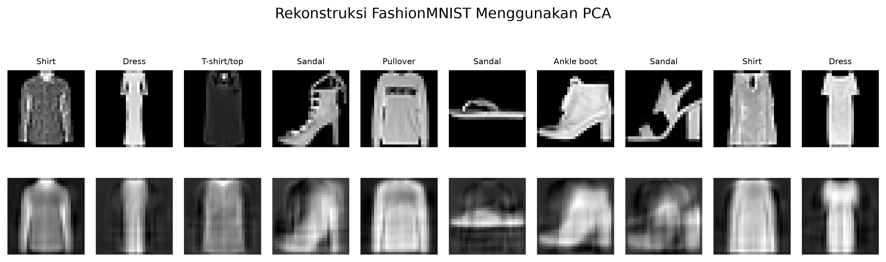
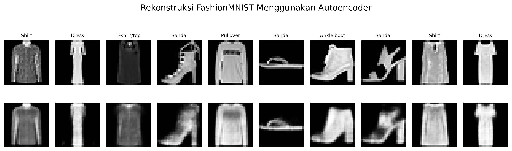
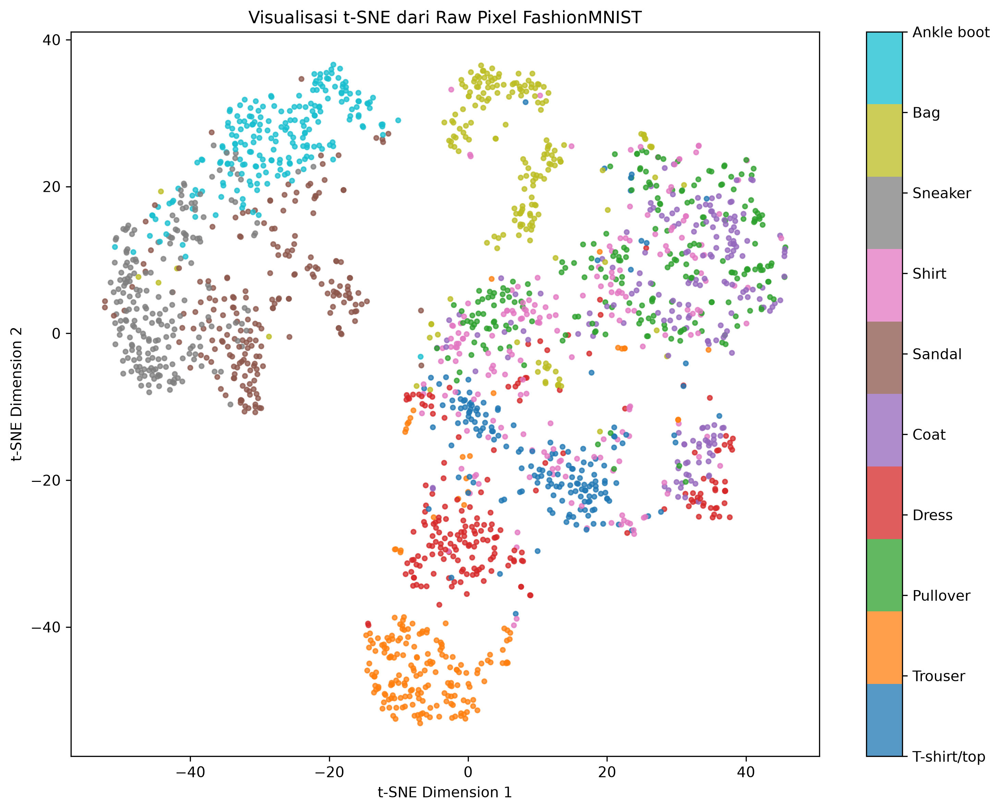
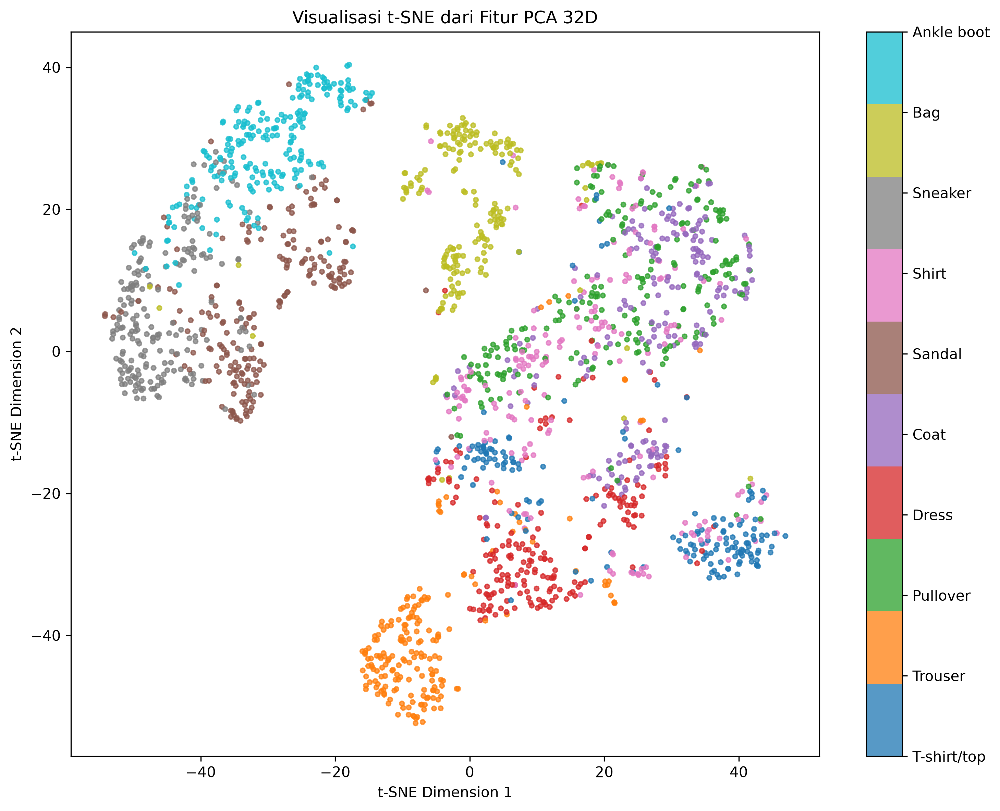
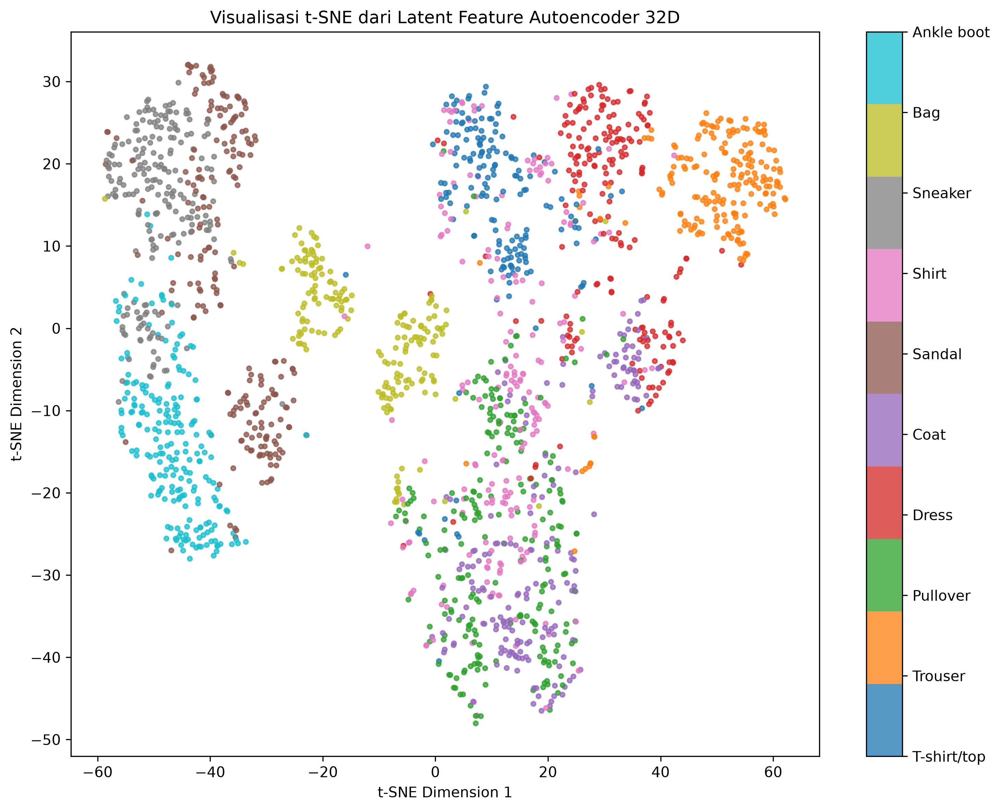
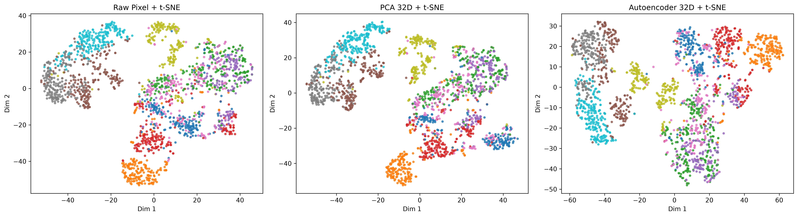

<div align="center">

# PCA vs Autoencoder pada FashionMNIST

### Perbandingan Reduksi Dimensi dan Visualisasi t-SNE Menggunakan FashionMNIST


**Mata Kuliah Data Mining**

**Universitas Udayana**

**Ida Bagus Gede Dhananjaya (2305551120)**

</div>

---

# Deskripsi Proyek

Proyek ini bertujuan membandingkan performa **Principal Component Analysis (PCA)** dan **Autoencoder** sebagai metode reduksi dimensi pada dataset FashionMNIST.

Representasi fitur yang dihasilkan kemudian divisualisasikan menggunakan **t-Distributed Stochastic Neighbor Embedding (t-SNE)** untuk menganalisis kualitas pemisahan antar kelas.

Eksperimen dilakukan menggunakan:

- PCA (reduksi dimensi linier)
- Autoencoder (reduksi dimensi berbasis neural network)
- t-SNE (visualisasi fitur berdimensi tinggi)

---

# Tujuan Eksperimen

1. Mengimplementasikan PCA pada FashionMNIST.
2. Mengimplementasikan Autoencoder menggunakan PyTorch.
3. Membandingkan reconstruction error kedua metode.
4. Memvisualisasikan hasil reduksi dimensi menggunakan t-SNE.
5. Mengevaluasi kualitas cluster menggunakan Silhouette Score.

---

# Struktur Proyek

```text
PCA-vs-Autoencoder-FashionMNIST/
│
├── notebooks/
│   ├── 01_setup_and_dataset.ipynb
│   ├── 02_pca_reduction.ipynb
│   ├── 03_autoencoder_training.ipynb
│   └── 04_tsne_visualization_and_analysis.ipynb
│
├── results/
│   ├── figures/
│   ├── pca_results.csv
│   ├── autoencoder_results.csv
│   ├── autoencoder_loss_history.csv
│   ├── tsne_metrics.csv
│   └── reduction_comparison.csv
│
├── models/
│
├── README.md
├── requirements.txt
└── .gitignore
```

---

# Dataset

Dataset yang digunakan adalah **FashionMNIST**.

Karakteristik dataset:

| Properti | Nilai |
|----------|--------|
| Jumlah Kelas | 10 |
| Train Set | 60.000 |
| Test Set | 10.000 |
| Ukuran Citra | 28 × 28 |
| Jumlah Fitur Awal | 784 |

Kelas FashionMNIST:

1. T-shirt/top
2. Trouser
3. Pullover
4. Dress
5. Coat
6. Sandal
7. Shirt
8. Sneaker
9. Bag
10. Ankle boot

---

# Metodologi

## PCA

PCA digunakan untuk mereduksi dimensi citra:

```text
784 → 32
```

Parameter:

```python
n_components = 32
```

---

## Autoencoder

Arsitektur Autoencoder:

```text
784
↓
256
↓
128
↓
32
↓
128
↓
256
↓
784
```

Konfigurasi:

```text
Epoch          : 20
Batch Size     : 128
Learning Rate  : 0.001
Optimizer      : Adam
Loss Function  : MSE Loss
```

---

## t-SNE

t-SNE digunakan untuk memvisualisasikan:

- Raw Pixel
- PCA Features
- Autoencoder Features

ke dalam ruang dua dimensi.

---

# Hasil Eksperimen

## PCA

| Metrik | Nilai |
|---------|---------|
| Dimensi Awal | 784 |
| Dimensi Akhir | 32 |
| Explained Variance | 82.66% |
| Reconstruction MSE | 0.0155 |
| Waktu Proses | 0.16 detik |

---

## Autoencoder

| Metrik | Nilai |
|---------|---------|
| Dimensi Awal | 784 |
| Dimensi Akhir | 32 |
| Reconstruction MSE | 0.0101 |
| Epoch | 20 |
| Waktu Training | 164 detik |

---

# Hasil Rekonstruksi

## PCA Reconstruction



---

## Autoencoder Reconstruction



---

# Visualisasi t-SNE

## Raw Pixel



---

## PCA Features



---

## Autoencoder Features



---

## Perbandingan Seluruh Metode



---

# 📊 Silhouette Score

| Metode | Silhouette Score |
|----------|----------|
| Raw Pixel + t-SNE | 0.1439 |
| PCA + t-SNE | 0.1524 |
| Autoencoder + t-SNE | 0.1501 |

---

# Analisis

Berdasarkan hasil eksperimen:

- PCA mampu mempertahankan 82.66% variasi data dengan waktu komputasi yang sangat cepat.
- Autoencoder menghasilkan reconstruction error yang lebih rendah dibandingkan PCA.
- PCA dan Autoencoder menghasilkan kualitas cluster yang relatif mirip pada FashionMNIST.
- PCA memperoleh silhouette score sedikit lebih tinggi dibandingkan Autoencoder.
- FashionMNIST merupakan dataset yang cukup menantang karena beberapa kelas memiliki kemiripan visual yang tinggi.

---

# Cara Menjalankan

Install dependency:

```bash
pip install -r requirements.txt
```

Jalankan notebook secara berurutan:

```text
01_setup_and_dataset.ipynb
02_pca_reduction.ipynb
03_autoencoder_training.ipynb
04_tsne_visualization_and_analysis.ipynb
```

---

# Environment

```text
Python 3.11
PyTorch 2.12.0 + CUDA 12.6
Torchvision 0.27.0
Scikit-Learn 1.9.0
GPU NVIDIA GeForce RTX 3050 Laptop GPU
```

---

# Penulis

**Ida Bagus Gede Dhananjaya**  
NIM: 2305551120  
Program Studi Teknologi Informasi  
Universitas Udayana

---

# Lisensi

Proyek ini dibuat untuk keperluan akademik pada mata kuliah **Data Mining**.
